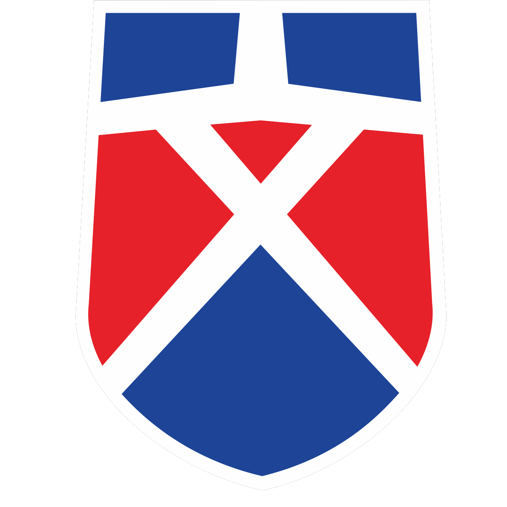
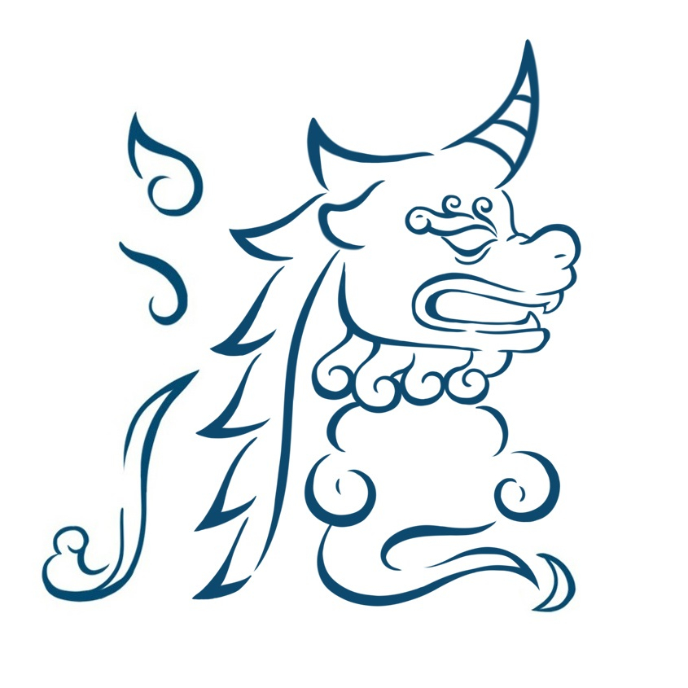

# 关于 獬豸诗集
獬豸诗集是文清外国语学校初中 2112 班语文综合性实践活动的产物，是 2112 班学生的作品，每个学生拥有自己作品的著作权（包括[序言](#关于序言)）。您可以引用其中的一句、一段、或整个作品并表明出处。

您不可以：

在未经原作者的授权且未表面出处的情况下，在任何平台转售、分售、拼团、二次许可。（即诗歌仅供学习 您若未经本人授权无权进行套用等其他操作）

# 关于序言

序言的作者为：刘沛言。

